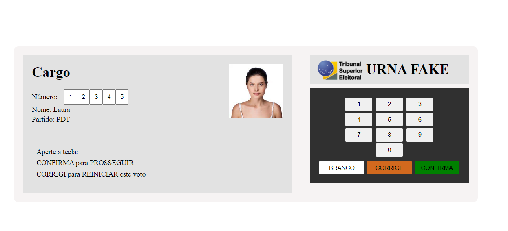
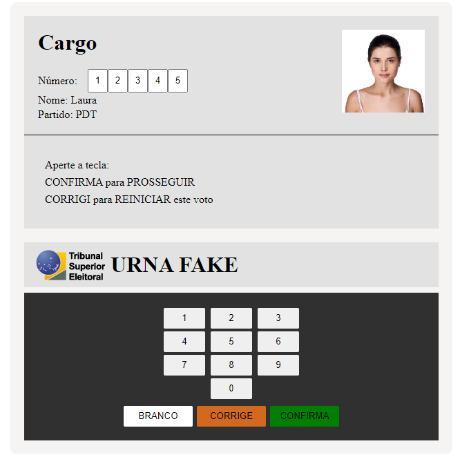

<h1 align="center"> Urna fake </h1>

 

  
    

## ⚙️ Como rodar o projeto:

- Clonar o projeto usando SSH e é necessário

## 🚀 Tecnologias:

Esse projeto foi desenvolvido com as seguintes tecnologias:

- Java Script
- Git e Github
- HTML e CSS

## 💻 Projeto:

Urna fake

---

Feito por João Meireles :wave: [Linkedin](https://www.linkedin.com/in/jpw-meireles/)
